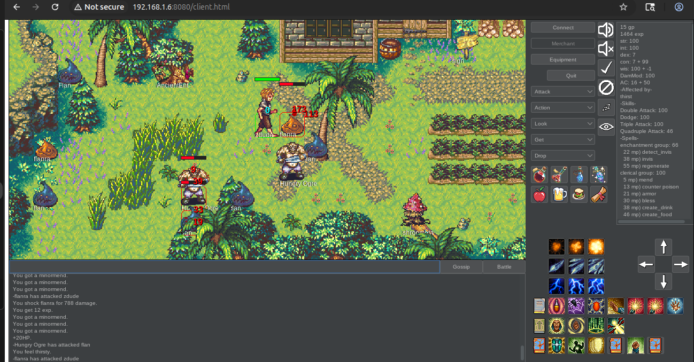

# DuskRPG

DuskRPG is a lightweight, open-source multiplayer game engine written in Java. It brings the classic text-based MUD experience into a graphical, 2D pixel-art world, reminiscent of early MMORPGs. The engine is designed to be highly efficient, with a lightweight server that uses a flat-file database system, making it easy to host and run your own worlds.

## Features

*   **Cross-Platform:** Play on your desktop or in a web browser thanks to CheerpJ.
*   **Lightweight:** The client and server are designed to run efficiently on a variety of systems.
*   **Classic MMORPG Gameplay:** Experience real-time combat, explore a vast world, and interact with NPCs.
*   **Customizable Worlds:** The engine is designed to be modular, allowing you to create and host your own unique game worlds with different rules and graphics.
*   **Open Source:** DuskRPG is an open-source project, and contributions are welcome!

## Screenshots

Here are some screenshots of the game in action.

*Desktop Client*


*Web Client*


## Getting Started

To get started with DuskRPG, you'll need to compile and run the server and client.

### Server

The server source code is located in `DuskFiles/DuskServerSource/`. To compile and run the server:

```bash
cd DuskFiles/DuskServerSource
javac *.java
cd ..
java -cp DuskServerSource DuskServer
```

### Client

The client source code is located in `DuskFiles/ClientSourceCJ/`. To compile and run the client:

```bash
cd DuskFiles/ClientSourceCJ
javac -cp ../../DuskComet-Richter/wwwClient/lib/flatlaf-3.4.1.jar:. *.java
java -cp ../../DuskComet-Richter/wwwClient/lib/flatlaf-3.4.1.jar:. Dusk
```

## Contributing

We welcome contributions to the DuskRPG project! If you'd like to contribute, please fork the repository and submit a pull request.

## License

DuskRPG is licensed under the terms of the GNU General Public License, as published by the Free Software Foundation. See the `COPYING` file for more details.
